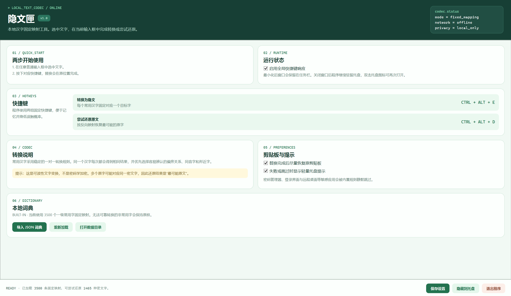

# 隐文匣

隐文匣是一个 Windows 本地汉字变换工具。

选中一段中文后，按下快捷键，程序会直接在原位置生成另一组变换加密汉字。对已经转换过的文字，也可以尝试还原为原文。

- 完全离线运行
- 不上传输入内容
- 不持续扫描键盘或输入框
- 无需安装 .NET 运行时

## 转换示例

转换前：

```text
天青色等烟雨，而我在等你......
```

按下 `Ctrl + Alt + E` 后：

```text
关请绝寺因雪，耐俄茬寺尔......
```

选中转换后的文字并按下 `Ctrl + Alt + D`，程序会尝试还原为最可能的原文。

## 界面预览



## 下载

1. 打开 [Releases 页面](https://github.com/csyxcsyx/MysteriousCharacters/releases/latest)。
2. 下载最新版本的 `MysteriousCharacters.exe`。
3. 双击 exe 即可运行。

程序启动后会显示主窗口，并在系统托盘中保留图标。

## 快速开始

### 转换为隐文

1. 在记事本、聊天输入框或其他普通文本框中选中一段中文。
2. 按下 `Ctrl + Alt + E`。
3. 选中的文字会在原位置替换为隐文。

### 尝试还原原文

1. 选中一段由隐文匣转换过的文字。
2. 按下 `Ctrl + Alt + D`。
3. 程序会替换为最可能的原文。

## 固定快捷键

| 操作 | 快捷键 |
| --- | --- |
| 转换为隐文 | `Ctrl + Alt + E` |
| 尝试还原原文 | `Ctrl + Alt + D` |

快捷键使用固定组合，不需要配置。

如果启动时提示快捷键注册失败，请关闭占用快捷键的软件后重新启动隐文匣。


## 窗口与托盘

| 操作 | 结果 |
| --- | --- |
| 点击最小化 | 窗口保留在任务栏 |
| 点击右上角关闭 | 窗口隐藏，程序继续在托盘运行 |
| 双击托盘图标 | 重新打开主窗口 |
| 点击窗口底部“隐藏到托盘” | 主动隐藏窗口 |
| 点击窗口底部“退出程序” | 完全退出 |

## 转换规则

- 内置 3500 个一级常用汉字规则。
- 同一个汉字每次都会转换为同一个目标字。
- 优先选择容易辨认的偏旁关系、同音字和形近字。
- 避免 `你 → 您`、`他 → 她`、`在 → 再`、`做 → 作` 等容易造成误解的替换。
- 无法可靠处理的非常用字会保持原样。

## 还原功能说明

隐文匣是可读性文字变换工具，不是密码学加密软件。

为了让输出保持为普通汉字，程序不会插入隐藏标记。少数不同原字可能对应同一个隐文字，因此还原结果是“最可能的原文”，不能保证所有内容都逐字无损恢复。

请勿使用隐文匣保护密码、密钥或高敏感信息。

## 隐私与资源占用

程序优先使用 Windows UI Automation 或标准文本框消息完成选区替换。目标软件不支持直接替换时，程序会回退到剪贴板方案，并在替换后尽量恢复原剪贴板内容。

隐文匣采用事件驱动方式：只有按下快捷键时才会读取当前选区并执行一次转换。程序不会持续扫描输入内容，也不会启动后台轮询任务。

密码管理器、Windows 登录界面和远程桌面等敏感应用会被内置规则静默跳过。管理员权限窗口、安全输入框、密码框、游戏窗口或特殊防注入软件也可能不会响应快捷键。

## 常见问题

### 已经选中文字，为什么仍提示没有读取到？

请先在记事本等普通文本框中重试。如果目标软件以管理员身份运行，请以相同权限启动隐文匣；Windows 会限制普通权限程序向管理员窗口发送复制和粘贴操作。

部分安全输入框、密码框、游戏窗口和特殊防注入软件不允许外部程序读取选区，隐文匣会跳过这些窗口。

如果普通输入框仍然无法转换，请打开主窗口底部的“打开数据目录”，查看 `diagnostics.log`。日志只记录系统架构、兼容策略和失败原因，不记录选中的文字内容。

## 自定义词典

主窗口支持导入本地 JSON 词典。格式参考 [custom-dictionary.example.json](examples/custom-dictionary.example.json)。

自定义词典按源字覆盖内置规则。设置和导入后的词典位于：

```text
%LocalAppData%\MysteriousCharacters
```

## 开发

构建：

```powershell
dotnet build .\MysteriousCharacters.slnx --configuration Release
```

运行冒烟测试：

```powershell
dotnet run --project .\MysteriousCharacters.SmokeTests -- .\examples\custom-dictionary.example.json .\data\level1-common-characters.txt
```

运行 Windows 输入框集成测试：

```powershell
dotnet run --project .\MysteriousCharacters.DesktopTests --configuration Release
```

该测试会创建临时输入框并切换前台焦点，请在 Windows 桌面已解锁时运行。

发布自包含单文件 exe：

```powershell
.\publish.ps1
```

默认输出 x64 原生版本：

```text
artifacts\win-x64\MysteriousCharacters.exe
```

发布全部 Windows CPU 架构版本：

```powershell
.\publish-all.ps1
```

如果只能发送一个 exe，优先发送兼容版：

```text
artifacts\windows-compatible\MysteriousCharacters.exe
```

兼容版使用 x86 自包含单文件，可在 x86、x64 和 Windows on Arm 的兼容层运行。追求原生性能时可按设备架构选择：

```text
artifacts\win-x64\MysteriousCharacters.exe
artifacts\win-x86\MysteriousCharacters.exe
artifacts\win-arm64\MysteriousCharacters.exe
```

文件校验值会写入：

```text
artifacts\SHA256SUMS.txt
```

## 词典生成

开发阶段可使用 [generate_common_character_rules.py](tools/generate_common_character_rules.py) 重新生成内置映射。脚本读取 [level1-common-characters.txt](data/level1-common-characters.txt)、CJKVI IDS 数据和 Unicode Unihan 数据；程序运行时不会联网。

覆盖统计见 [common-character-coverage.json](docs/common-character-coverage.json)，第三方数据来源与许可见 [THIRD_PARTY_NOTICES.md](THIRD_PARTY_NOTICES.md)。
